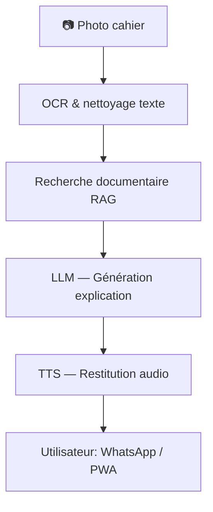

# Moteyi — README_Architecture (sobre & technique)

## 1. Contexte métier & objectif pédagogique
Moteyi est un tuteur IA multilingue (FR + langues nationales : Lingala, Kikongo, Tshiluba, Swahili, Anglais).  
Objectif principal : offrir une **explication vocale claire en ≤ 5 secondes** après la prise en photo d’un exercice du cahier.  

Enjeux pédagogiques :  
- Accessibilité linguistique pour les élèves et familles.  
- Conformité aux programmes scolaires officiels de la RDC.  
- Automatisation de l’aide aux devoirs via WhatsApp et une PWA.  

---

## 2. Architecture fonctionnelle
Pipeline applicatif :  


---

## 3. Architecture technique

### Données
- `data/rag_seed/**` : 117 PDFs officiels (programmes, guides, manuels).  
- `data/rag_seed/rag_seed_catalog.csv` : catalog des métadonnées.  
- `data/index/manifest.json` : index des documents pour le RAG.  
- `data/eval/gold.jsonl` : jeu de test d’évaluation (182 QA).  

### Scripts
- `scripts/validate_rag.py` : validateur dual-mode (CI = contrat, local = présence fichiers).  
- `scripts/rag_eval.py` : évaluation des performances du RAG (Hit@1, Coverage@5).  
- `scripts/hook_validate.py` : wrapper pre-commit cross-platform.  

### Outils de monitoring
- `tools/corpus_audit.py` : audit couverture et alignement catalog/manifest.  
- `tools/align_ids_to_filename.py` : alignement automatique `id = filename.pdf`.  

### CI/CD & pré-commit
- **CI/CD (GitHub Actions)** : workflow “RAG Catalog Validate” → vérifie schéma + IDs, publie artefact `catalog_meta.json`.  
- **Pre-commit hook** : exécution automatique de `validate_rag.py` à chaque commit modifiant manifest/catalog.  

---

## 4. Bonnes pratiques qualité & monitoring
- IDs des documents = `filename.pdf` (contrat).  
- Colonnes catalog acceptées : `id`, et l’une de `file|file_path|path`.  
- Validation dual-mode :  
  - CI (rapide, sans PDFs lourds).  
  - Local (robuste, vérifie présence des fichiers).  
- Monitoring : audit régulier (`make audit`), rapports JSON/CSV en `reports/`.  
- Évaluation systématique sur gold set : `make eval`.  

---

## 5. Diagramme d’arborescence du repo
```text
moteyi-mvp/
├── data/
│   ├── rag_seed/
│   │   ├── rag_seed_catalog.csv
│   │   └── [... 117 PDFs ...]
│   ├── index/
│   │   └── manifest.json
│   └── eval/
│       └── gold.jsonl
├── scripts/
│   ├── validate_rag.py
│   ├── rag_eval.py
│   └── hook_validate.py
└── tools/
    ├── corpus_audit.py
    └── align_ids_to_filename.py
```

---

## 6. Liens vers les visualisations interactives
- [Architecture WOW (HTML)](moteyi-architecture-wow.html)  
- [Monitoring interactif (HTML)](moteyi_monitoring_architecture_interactive_html.html)  
- [Monitoring pipeline (HTML)](moteyi-monitoring-architecture.html)  
- [Audit couverture (JSON)](reports/corpus_audit_report.json)  

---

## 7. Résultats de validation (référence étape 6)
- PDFs : 117 / 117 indexés.  
- Coverage@5 : 100%.  
- Hit@1 : 100%.  
- Non indexés : 0.