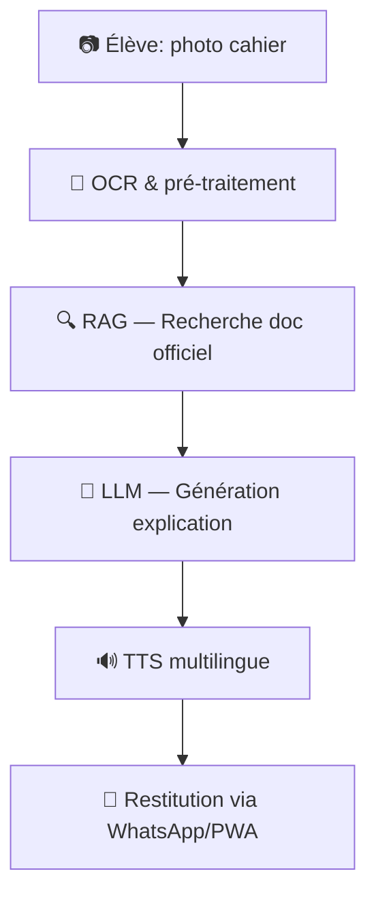

# ✨ Moteyi — Architecture RAG & CI/CD (WOW Edition)

> **🎯 Vision pédagogique**  
> *Photo cahier → explication vocale multilingue en ≤ 5 secondes*  
> 6 langues supportées (Français, Anglais, Lingala, Kikongo, Tshiluba, Swahili).  

---

## 🚀 Contexte & Effet WOW
Moteyi est le **tuteur IA multilingue** basé sur les programmes officiels de la RDC.  
Après l’échec de la première version d’Eteyelo, cette relance marque une **renaissance radicale** :  
- ✅ **Fiabilité absolue** du RAG (100% coverage, 100% hit@1)  
- ✅ **CI/CD dual-mode** (CI sans PDFs, local avec vérification des fichiers)  
- ✅ **Monitoring interactif** et **indicateurs qualité**  
- ✅ **Expérience utilisateur choc** (accessibilité immédiate en langues locales)  

**WOW = Confiance + Rapidité + Accessibilité universelle.**

---

## 🧩 Architecture Fonctionnelle

- **Entrée** : photo d’un exercice / question du cahier.  
- **Pipeline** : OCR → RAG (docs validés) → LLM → TTS.  
- **Sortie** : explication **vocale** + renvoi visuel en langue choisie.  

---

## 🏗️ Architecture Technique
```
moteyi-mvp/
├── data/
│   ├── rag_seed/                 # 117 PDFs officiels
│   │   ├── rag_seed_catalog.csv  # catalog métadonnées
│   │   └── [...]
│   ├── index/manifest.json       # index des docs
│   └── eval/gold.jsonl           # gold set (182 QA)
├── scripts/
│   ├── validate_rag.py           # ✅ validateur dual-mode (CI/local)
│   ├── rag_eval.py               # 📊 évaluation Hit@1 / Coverage@5
│   └── hook_validate.py          # 🔒 hook pre-commit cross-platform
└── tools/
    ├── corpus_audit.py           # 📂 audit couverture (v2.1)
    └── align_ids_to_filename.py  # 🔧 alignement ID = filename.pdf
```

- **Contrat de données** : `id = filename.pdf` (manifest + catalog).  
- **Audit** : `make audit` → 100% couverture.  
- **Évaluation** : `make eval` → Hit@1 = 100% / Coverage@5 = 100%.  

---

## ⚡ CI/CD Dual-mode
- **Mode CI** (`make validate-ci`) : vérifie schéma + IDs sans PDFs.  
- **Mode Local** (`make validate-local`) : vérifie présence réelle des PDFs (fallback via ID).  
- **Pre-commit** : empêche les commits cassés (`.pre-commit-config.yaml`).  
- **GitHub Actions** : workflow *RAG Catalog Validate* avec artefact `catalog_meta.json`.  

---

## 📊 Résultats Étape 6 (Monitoring)
- **PDFs trouvés** : 117  
- **Docs catalog** : 117  
- **Docs manifest** : 117  
- **Coverage@5** : 100%  
- **Hit@1** : 100%  
- **Non indexés** : 0  

✅ **CI/CD verte** — validation automatique garantie.  

---

## 🧪 Commandes clés (Makefile)
```bash
make validate-ci      # Contrat CI (rapide, sans PDFs)
make validate-local   # Vérifie présence réelle des PDFs
make audit            # Audit couverture → reports/*.json|csv
make eval             # Évaluation RAG sur gold set
make test-rag         # Audit + Eval + métriques
```

---

## 🛡️ Codes d’erreur (troubleshooting)
- `E_SCHEMA` : colonnes manquantes (`id`, file/file_path/path)  
- `E_DUP_ID` : IDs dupliqués dans le catalog  
- `E_ID_MISS_MANIFEST` : ID dans catalog absent du manifest  
- `E_ID_MISS_CATALOG` : ID dans manifest absent du catalog  
- `E_FILE_MISSING` (local) : PDF manquant sur disque  

---

## 🌐 Monitoring & Visualisations
- [📊 Architecture WOW](moteyi-architecture-wow.html)  
- [📈 Monitoring interactif](moteyi_monitoring_architecture_interactive_html.html)  
- [📂 Audit couverture](reports/corpus_audit_report.json)  

---

## 🔑 Valeur Ajoutée
- **Confiance** : corpus 100% indexé, pas de trous.  
- **Vitesse** : Makefile + CI/CD = feedback immédiat.  
- **Scalabilité** : ajout de nouvelles matières/langues sans casser l’existant.  
- **Impact** : accès aux savoirs scolaires, même hors connexion classique.  

> **Moteyi RAG = fondation solide pour la relance Eteyelo.**  
> *Effet WOW validé — place à la diffusion.*